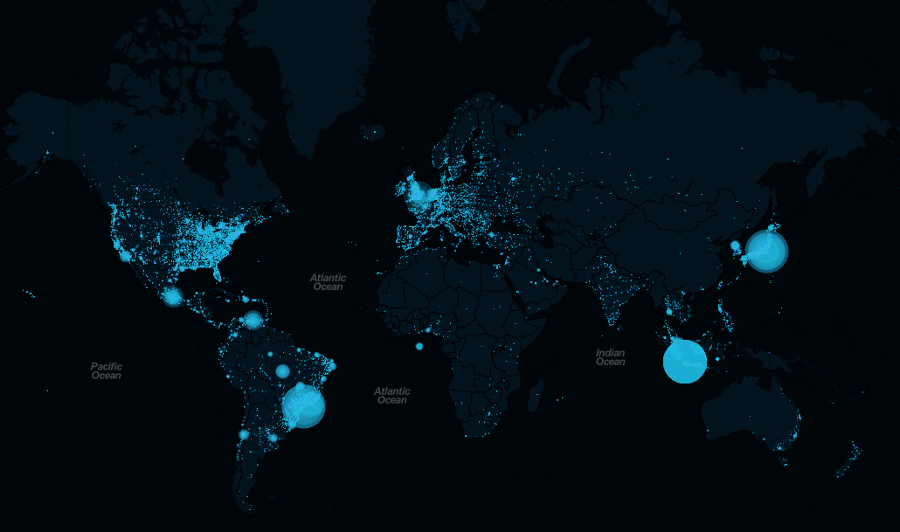
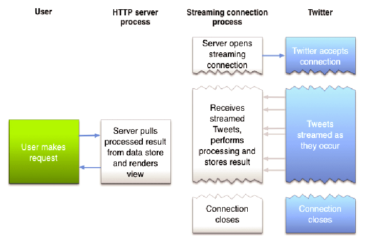

title: Real-Time Twitter Stream
date: 2017-11-07
slug: /blog/real-time-twitter-stream
description: Stream live tweets across the world in real-time on a world map.
tags:

- Python
- Twitter Streaming API
- Flask

---



Streaming live tweets across the world in real-time on a world map. This web app attaches to the 
[Twitter Streaming API](https://developer.twitter.com/en/docs/tutorials/consuming-streaming-data) and extracts tweets
with geo data using an open-source python library [Tweepy](http://docs.tweepy.org/en/v3.5.0/getting_started.html#introduction) 
that acts as a communicator to Twitter API.

### Motivation

The number of devices that translate real-world events into a constant stream of zeros and ones continues to expand faster
than ever. To account for this huge influx of new data, the technology used to capture, process, and analyze this information
also needs to keep up. Embracing real-time is the only option for companies seeking to elevate both the speed and the quality
of information their business is analyzing.

Recently, I started working on an interesting pet project that involved Twitter Streaming API. First of all, let introduce to
this API.

### Setup & Development

#### Twitter Streaming API



Twitter Streaming API allows you to connect to the Twitter stream of tweets. That means you can get tweets depending on some 
hashtags/language/location in near real-time. This API is really useful when you need to track and react, for instance, when
someone mentions your company’s name. Your application can receive the tweet instantly and take action based on that tweet.

The only issue with this API is the consumption limits. The API doesn't enforce strict API limits but can stop streaming at 
any time. Every Twitter account can connect to a small sampling of the streaming API. This is done to guarantee users a good 
experience. The development of tools to spam, mislead users, and so on is forbidden. You can read more about this API 
[here](https://developer.twitter.com/en/docs)

#### Invoking Twitter API with Tweepy

![tweepy]tweepy.png)

[Tweepy](http://www.tweepy.org/) is an open-source Python package that gives you a very convenient way to access the Twitter 
API with Python. Tweepy includes a set of classes and methods that represent Twitter’s models and API endpoints, and it 
transparently handles various implementation details, such as:

- Data encoding and decoding
- HTTP requests
- Results pagination
- OAuth authentication
- Rate limits
- Streams

If you weren’t using Tweepy, then you would have to deal with low-level details having to do with HTTP requests, data serialization,
authentication, and rate limits. In order to connect to the stream with Tweepy, we have to set up authentication. Twitter API requires 
that all requests use [OAuth](https://oauth.net/2/) to authenticate. These credentials are four text strings:

1. Consumer key
2. Consumer secret
3. Access token
4. Access secret

**Authenticate with Twitter**
Tweepy takes care of all the details for using `OAuth` required by the Twitter API to authenticate each request. It provides an 
`OAuthHandler` class that you can use to set the credentials to be used in all API calls.

```python
import tweepy

# Authenticate to Twitter
auth = tweepy.OAuthHandler("CONSUMER_KEY", "CONSUMER_SECRET")
auth.set_access_token("ACCESS_TOKEN", "ACCESS_TOKEN_SECRET")

```
**Create a class inheriting from `StreamListener`**

```python
import tweepy
#override tweepy.StreamListener to add logic to on_status
class MyStreamListener(tweepy.StreamListener):

    def on_status(self, status):
        print(status.text)

```

**Using this class to create a `Stream` object passing the auth API and stream listener.**

```python
myStreamListener = MyStreamListener()
myStream = tweepy.Stream(auth = api.auth, listener=myStreamListener

```

**Starting a Stream**
In this example we will use location to stream all tweets falling under the bound box.

```python
twitterStream.filter(locations=[
        -130.78125, -31.3536369415, 140.625, 63.8600358954
    ])

```
#### Building a Flask Server
We now create a flask server to route streaming tweets to an endpoint. We converted the incoming JSON format into GeoJSON to view it on a map.

```python
@app.route('/data')
def stream_data():
    new_data = []
    for item in data:
        temp_data = {}
        temp_data['geometry'] = {}
        temp_data['properties'] = {}
        temp_data['type'] = 'Feature'
        temp_data['geometry']['type'] = 'Point'
        temp_data['geometry']['coordinates'] = item['coordinates']['coordinates']
        temp_data['properties']['name'] = item['text']
        new_data.append(temp_data)
        return jsonify(new_data)

```
We can finally return the Flask response to be rendered by the front end leaflet map.
### Summary
The project is all about building a real-time twitter stream that streams live tweets coming from across all countries and presenting it on global 
map in real time. It is hosted on local server built using Flask( a micro framework for Python), coded completely in Python, using Twitter’s streaming 
API(Twitter for Developers).The frontend map is built using the custom [Leafletjs](https://leafletjs.com/) (an open source javascript library for mobile-friendly interactive maps).

You can find the entire code [here](https://github.com/saheelahmed2/Real-Time-Twitter-Stream)
### Resources

- [Flask](http://flask.pocoo.org/)
- [Twitter Streaming API](https://developer.twitter.com/en/docs/tutorials/consuming-streaming-data)
- [Tweepy](http://docs.tweepy.org/en/v3.5.0/)
- [Leaflet Js](http://leafletjs.com/)
- [AJAX/Jquery](https://jquery.com/)