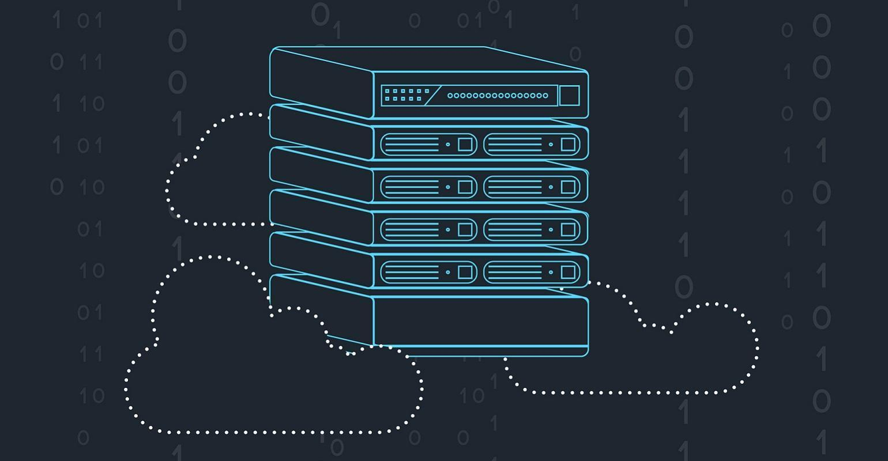

### What is Serverless Architecture ?
It is a software design pattern that allows applications to be hosted on third-party service thus eliminating 
the need for traditional always-on server software and hardware management by developers. Your application still
runs on servers, but all the server management is done by a third party. Applications are broken up into individual 
functions that run in stateless compute containers. Containers that are event-triggered, ephemeral (may last for 
one invocation), and fully managed by the cloud provider. Pricing is based on a number of execution rather than 
compute capacity. Autoscaling & fault-tolerant by default.

> “Serverless computation is going to fundamentally not only change the economics of what is back-end computing,
but it’s going to be the core of the future of distributed computing.” — Satya Nadella